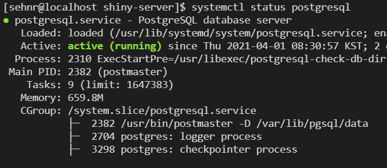

# DataBase in R and SQL basic
> 유승찬 (2021-03-31) and 윤진하 (2021-04-05)

## 데이터 베이스와 데이터 베이스 시스템
> author: 유승찬
> 데이터베이스 (DataBase)

**데이터 저장 구조** 는 아래처럼 구분해 볼 수 있습니다. 우리가 이번시간에 다루는 것은 논리적 구조에 관한 것입니다.

논리적 구조 | 물리적 구조
---|---
사용자 관점에서 데이터베이스의 논리적 구조|전자기적 저장장치(Disc)에 물리적으로 저장되는 데이터 구조
동일한 의미를 가진 데이터 집합관 표현된 데이터 구조| 전자기적 저장장치에 기록, 저장되는 데이터 구조로 물리적 배치를 표현


* 데이터베이스
  + 체계화된 데이터 모임
  + 작성된 목록으로써 여러 응용 시스템들의 통합된 정보들을 저장하여 운영할 수 있는 공용 데이터 묶음
  
* 데이터베이스의 특징
  + 실시간 접근성
  + 지속적인 변화
  + 동시 공유
  + 내용에 의한 참조
  
* 데이터베이스의 개념
  + 통합된 데이터(intergrated data)
    + 다중 유저, 통합관리, 중복 최소화
  + 저장
  + 운용
  + 시스템
  
* 데이터베이스관리 시스템
  + DBMS(DB management system)
  + DBMS 기능
  + 정의: 데이터에 대한 형식, 구조, 제약조건들을 명세
  + 구축:DBMS가 관리하는 기억 장체 데이터를 저장
  + 조작:질의, 갱신, 보고서
  + 공유: 여러사람
  + 보호
  + 유지 보수

> 데이터베이스의 특성

|특성|파일시스템|데이터베이스 시스템|
|---|---|---|
|데이터에 대한 접근|물리적 접근|물리적&논리적 접근|
|동시 사용| 동일한 파일을 두개 이상의 프로그램이 동시에 접근할 수 없음|동일한 데이터를 다수 사용자가 동시에 접근 가능|
|구조화 및 중복성|비구조적, 중복성과 유지보수 비용 높음|구조화 되어 있음. 중복성과 유지보수 비용 낮음|
|데이터 공유|특정 프로그램만 접근|접근 권이이 있는 모든 프로그램이 공유|
|데이터 접근| 미리 작성된 프로그램을 통해서만|다양한 질의어를 이용하요 융통성 있는 접근|
|통합성|각 응용프로그램마다 파일에 따로 존재|데이터가 중복을 배제하면서 통합되어 있음|


 
> 파일 시스템과 데이터 베이스 시스템 차이 

하번 생각해보세요


 
|데이터베이스 장점 
|---
|중복과 불일치 감소
|시스템 융통성
|시스템 개발 및 유지 비용 감소
|표준화 시행이 용이
|보안이 향상됨
|데이터 무결성이 향상됨
|조직체의 요구 사항을 파악하여 조정 가능
|시스템의 고장으로 데이터 베이스 복구 가능
|DB 공유와 업그레이드 쉬음

## 관계형 데이터베이스
본 수업에서 주로 관계형 데이터 다룸
;
<p></p>
[Wiki Img](https://upload.wikimedia.org/wikipedia/commons/thumb/7/7c/Relational_database_terms.svg/350px-Relational_database_terms.svg.png)


<p></p>
> 관계형 데이터의 구조

SQL term |	Relational database term |	Description
:-|:--|------
Row	| Tuple or record	| A data set representing a single item
Column |	Attribute or field |	A labeled element of a tuple, e.g. "Address" or "Date of birth"
Table |	Relation or Base relvar |	A set of tuples sharing the same attributes; a set of columns and rows
View or result set |	Derived relvar |	Any set of tuples; a data report from the RDBMS in response to a query


* 스키마
  + 릴레이션의 기본적 구조, 테이블을 디자인하기 위한 청사진
* 튜플
  + 각각의 행
  + 속성의 모임
* 속성
  + 가장 작은 논리적 단위
* 도메인
  + 속성이 가질수 있는 값의 집합

<p></p>

대부분 key를 갖고 있다. `rownumber()`는 항상 변하니 **key**가 중요. 
>유일하면서 null 이 없어야 primay key
>외래키: 다른 릴레이션의 기본 키를 참조하는 애트리뷰트

아래 관계형 데이터가 있습니다. key 는 무엇일 까요?
```{r import library ReDaMoR, warning=FALSE, message = FALSE}
if(!require(ReDaMoR)) install.packages('ReDaMoR')
library(ReDaMoR)
hpo_model <- read_json_data_model(
  system.file("examples/HPO-model.json", package="ReDaMoR")
)
plot(hpo_model)
```


## SQL (Structured Query Language)
 IBM에서 개발 1972년부터 사용 세계 3대 coding language (1위 python, 2위 R, 3위 sql in kaggle)
 DataScience 할때 주로 상기 3개 언어를 사용한다고 함. 

* 3 function
  + 데이터 정의어
    + 데이터 저장 구종, 데이터 접근 방법, 데이터 형식 등 데이터베이스를 구추갛거나 수정
    + SCHEMA, DOMAIN, TABLE, VIEW, INDEX

  + 데이터 조작어
    + SELECT, INSERT, UPDATE ,DELETE

  + 데이터 제어어
    + commit, rollback, grant, revoke
    


> sql cheat sheet 참조 

[SQL 참조 site](https://www.sqltutorial.org/sql-cheat-sheet/)
```{r SQL sheet, out.height = "800px", out.width='800px', echo=F}
knitr::include_graphics("img/sqlcheet.pdf")
```


### R and DBI
R에서 DB를 사용하기 위해서, `DBI` 를 설치하고 이후 `Rposgres` 등 DBMS 페키지를 사용함.


**실습 자료는** OMOP-CDM 자료를 사용

[OMOP CDM 참조 site](https://github.com/OHDSI/CommonDataModel/wiki)


**download R script from github** 
in terminal
```
$ https://github.com/dr-you-group/OmopCdmExercise.git
```

## R PostgreSQL 실습


**참고 동영상**

<iframe width="800" height="440" src="https://www.youtube.com/embed/ac5d8ab8tjU" title="YouTube video player" frameborder="0" allow="accelerometer; autoplay; clipboard-write; encrypted-media; gyroscope; picture-in-picture" allowfullscreen></iframe>

 오픈 소스이면서 호환성이 높음. 1위) Oracle, 2위) MySQL 3위) Microsoft SQL, 4위) PostgreSQL 임. 

[DB engine ranking](https://db-engines.com/en/ranking)


<p></p> 
이번 시간에는 PostgreSQL 설치 방법, DB 파일 생성과 활용에 대해서 실습해 보겠습니다. 
최종 적으로는 간단한 DB 파일을 읽어 오는 것을 목표로 하겠습니다. 

### PostgreSQL 설치

터미널에서 실행하게 됩니다. 한줄씩 실행해 주십시오. `sudo apt-get install unixodbc-dev` 에서만 오류가 나지 않으면 됩니다. 아래의 파일은 JAVA 설치 및 경로 지정, 그리고 `ODBC` 설치 과정입니다. `ODBC`를 설치하여 어떠한 프로그램이든지 쉽게 DB에 접근하고 명령문(커리)을 작성하여 DB를 가져오기 쉽게표준 번역 같은 기능을 제공한다고 생각할 수 있습니다. 이후 PostgreSQL을 사용하기 위해 설치 준비중이라고 볼 수 있습니다. JAVA는 향후 JDBC 사용이 필요한 경우를 위해 미리 설치하는 것입니다. 만약 오류가 난다면 이번 실습을 위해서는 넘어가도 되겠습니다. 

```
java -version
sudo -s
sudo apt-get update
sudo apt-get upgrade
sudo apt-get install -y default-jre
sudo apt-get install -y default-jdk
sudo R CMD javareconf
sudo apt-get install unixodbc-dev
sudo reboot
```

컴퓨터가 꺼졌다 다시 켜질 것 입니다. `reboot`. 시간이 좀 지나면 다시 Terminal에 명령어가 켜질 것입니다. 
이후 Terminal 에서 
`postgreSQL`과 관련있는 페키지를 설치합니다. 또한 ODBC와 PostgreSQL을 같이 사용하기 위한 페키지를 설치합니다. 

```
sudo apt-get -y install postgresql postgresql-contrib
sudo apt-get install odbc-postgresql
systemctl status postgresql
```
아래와 같은 화면이 출력되면 정상입니다. 


현재 postgres 라는 계정이 자동 생성되어 있고 이것이, 관리자 계정입니다. 로그인 해보자!

```
sudo -i -u postgres
psql

postgres=# \password postgres
postgres=# dspub2021
postgres=# \q

usermod -aG sudo postgres
passwd postgres
systemctl status postgresql
```
 이제 몇가지 설정을 진행하도록 하겠습니다. 외부에서도 접속할 수 있도록 `listen_addresses = '*'` 와 `host all all 0.0.0.0/0 md5`를 해보도록 하겠습니다. 이후 `restart` 하겠습니다. 

```
cd /etc/postgresql/12/main
vi postgresql.conf
>>>>  여기 고쳐 주세요 listen_addresses = '*'
>>>> :wq! 로 나오기
vi pg_hba.conf
>>>>> 여기 고쳐 주세요 host all all 0.0.0.0/0 md5
>>>> :wq! 로 나오기
systemctl restart postgresql
sudo apt install firewalld
sudo firewall-cmd --zone=public --permanent --add-port=5432/tcp
sudo firewall-cmd --reload
```
만약 방화벽 설정이 않된다면, GCP 처음 설치 강좌에서 수동으로 방화벽 설정했던 곳에 prt 5432를 추가해줍니다. 


이제 ocdm DB를 생성해 보겠습니다. open_cdm 이라는 유저에 ocdm이라는 DB를 설정한다는 것입니다. 
```
sudo -i -u postgres psql
> create user open_cdm;
> alter user open_cdm with password 'j2data2020';
> create database ocdm with owner open_cdm encoding 'UTF8' template template0;
>/q
```

접속해 보겠습니다. 

```
ifconfig
psql -h localhost -U open_cdm -d ocdm
```
처음부터 모든 DB를 만드는 것은 시간이 오래 걸리므로 이번 시간에는 만들어진 DB를 가져와보겠습니다. DsPub 기본 수업에서 사용했던 온도 자료와 사망자료를 DB로 만든 DB: ocdm 를 사용하겠습니다. 
pg_dump [IP of dspub.org] open_cdm ocdm > all.sql 에서 [IP of dspub.org] 는 192.168.0.2 처럼 IP 주소를 의미합니다. 

```
su dspub
sudo -s 
cd /home/dspub/download
pg_dump -C -h 34.64.152.186 -U open_cdm ocdm > all.sql
```
꽤 시간이 지나면 dspub.org 에 있는 DB가 `all.sql`형식으로 다운로드 된 것을 볼 수 있습니다. 

```
ls
su postgres
psql -f all.sql ocdm
```

### R 로 DB 확인

아래 명령문을 이용하여 R 에서 DB를 확인해 보겠습니다. 

```{r, eval=FALSE, message =FALSE, warning=FALSE}
#if(!require(rJava)) install.packages('rJava');library(rJava)
if(!require(DBI)) install.packages('DBI'); library(DBI)
if(!require(odbc)) install.packages('odbc'); library(odbc)
odbc::odbcListDrivers()
con <- DBI::dbConnect(odbc::odbc(),
                      Driver   = "PostgreSQL",
                      Server   = "localhost",
                      Database = "ocdm",
                      UID = "open_cdm", 
                      PWD = "j2data2020",
                      #UID      = rstudioapi::askForPassword("Database user"),
                      #PWD      = rstudioapi::askForPassword("Database password"),
                      Port     = 5432)

```

```{r, echo=FALSE, message = FALSE, warnning =FALSE}
library(tidyverse)
library(haven)
library(readxl)
#library(plyr)
library(lubridate)
library(doMC)
library(data.table)
library(DBI)
library(odbc)
library(RPostgreSQL)
library(dplyr)
library(DatabaseConnector)
library(DatabaseConnectorJars)
library(odbc)
con <-connect(dbms = "postgresql", 
              connectionString = "jdbc:postgresql://183.96.183.140:5432/ocdm",
              user     = 'open_cdm', 
              password = 'j2data2020')
```

#### R SQL example
 
  
  몇가지 실습을 해보도록 하겠습니다. 오늘은 딱 3가지 명령문을 사용하도록 하겠습니다. 
  <iframe width="560" height="315" src="https://www.youtube.com/embed/ZwynB1801zQ" title="YouTube video player" frameborder="0" allow="accelerometer; autoplay; clipboard-write; encrypted-media; gyroscope; picture-in-picture" allowfullscreen></iframe>
  

|명령문|내용|
|---|---|
|dbGetQuery| DB에서 파일 불러오기|
|dbSendStatement| PostgreSQL Schema, Table 관리|
|dbWriteTable| DB에 Table 적제|

```{r, eval = FALSE, message =FALSE, warning=FALSE}
if(!require(DBI)) install.packages('DBI'); library(DBI)
if(!require(odbc)) install.packages('odbc'); library(odbc)
if(!require(tidyverse)) install.packages('tidyverse');library(tidyverse)
odbc::odbcListDrivers()
con <- DBI::dbConnect(odbc::odbc(),
                      Driver   = "PostgreSQL Unicode",
                      Server   = "localhost",
                      Database = "ocdm",
                      UID      = rstudioapi::askForPassword("Database user"),
                      PWD      = rstudioapi::askForPassword("Database password"),
                      Port     = 5432)


## sql: dbGetQuery, dbSendStatement, dbWriteTable
### dbGetQuery

test <- dbGetQuery(con, "SELECT * from kosis.death LIMIT 10")
lkup <- dbGetQuery(con, "SELECT * from kosis.death_region_lkup")
View(lkup)
dbSendStatement(con, "drop table if exists kosis.death_region_lkup")
dbWriteTable(con, SQL("kosis.death_region_lkup"), value = lkup)
dbSendStatement(con, "drop schema if exists kosis cascade")
dbSendStatement(con, "drop schema if exists wanhyung cascade")

## new kosis 

death_dic = read_csv("death_dic.csv")
death2019 = read_csv("death2019.csv")

dbSendStatement(con, "create schema death")
dbWriteTable(con, SQL("death.death_dic"), value = death_dic)
dbWriteTable(con, SQL("death.death2019"), value = death2019)

```


 
